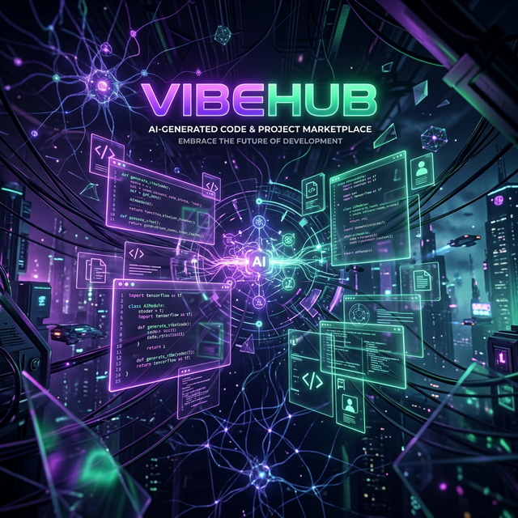
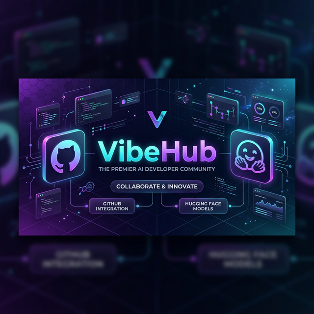
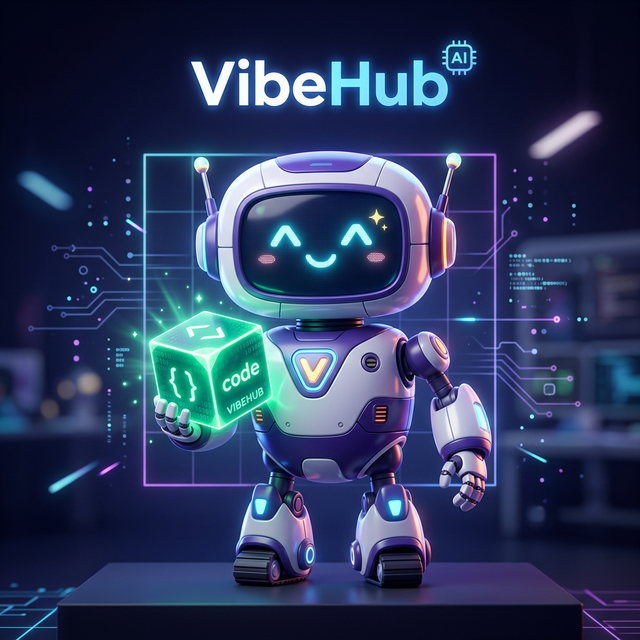

# ⚡ VibeHub

### The Creative Marketplace for 100% AI-Generated Projects

## 🌟 Overview

**VibeHub** is a premier community and marketplace built exclusively for **Vibe Coding** enthusiasts and AI-driven developers. We believe in a future where code is not just written, but *prompted and orchestrated*. 

Unlike traditional code repositories, VibeHub focuses on the **end-to-end AI generation process**, providing a stage for projects that are born entirely from AI tools like Cursor, v0, Claude, and GitHub Copilot.

---

## ✨ Key Features

- 🤖 **Pure AI Validation**: We only accept projects generated through AI-human collaboration (Vibe Coding).
- 🧠 **AI Curation System**: Automated classification and feedback for every project using advanced LLMs.
- 💎 **Vibe Marketplace**: A hub to share, fork, and trade AI generation templates and prompts.
- 🏆 **Dynamic Leaderboard**: Real-time rankings based on project popularity, code quality, and "Vibe" scores.
- 🔗 **Identity Integration**: Seamless developer profile linking with GitHub and Hugging Face.

---

## 🚀 Vision

From "Vibe Coding" to fully autonomous AI agents, VibeHub is the town square for the next generation of builders who are redefining the boundaries of software development.

## 🛠 Built With

- **Framework**: [Next.js 15](https://nextjs.org/) (App Router)
- **Styling**: Vanilla CSS with a focus on modern "Vibe" aesthetics (Glassmorphism, Neon Gradients)
- **Icons**: [Lucide React](https://lucide.dev/)
- **Infrastructure**: [Netlify](https://www.netlify.com/)

## 🌈 Join the Movement

Visit the live community: **[VibeHub Live](https://1gebio-vibehub.netlify.app)** *(Update with your actual URL)*

---

### Developed by AI, for the AI Generation. 🤖✨

